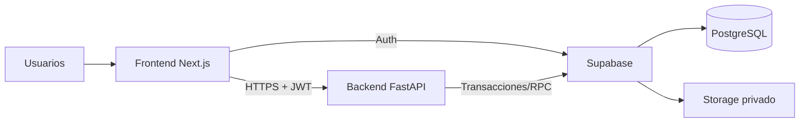

# Sistema de Gestión de Gastronomía

Aplicación web para controlar el inventario, solicitudes, reservas, préstamos, devoluciones, novedades, mantenimiento y trazabilidad de los recursos usados en prácticas académicas de Gastronomía.

El alcance funcional completo está documentado en [`docs/requirements/`](/Users/hernandezaxel/proyectos/Gastronimia/docs/requirements). Este repositorio contiene la base técnica, separada por responsabilidades, sobre la que se desarrollará el MVP.

## Estado actual

El backend y Supabase del MVP están implementados y verificados para desarrollo local:

- Frontend Next.js con TypeScript estricto, Tailwind, ESLint y Vitest.
- Backend FastAPI con configuración tipada, endpoint de salud, Ruff, mypy y pytest.
- Supabase con PostgreSQL, Auth, RLS, Storage privado y migraciones aplicadas.
- Plantillas de variables de entorno sin secretos.
- Flujo de CI para validar ambas aplicaciones.

Están disponibles autenticación, academia, inventario, disponibilidad, solicitudes, reservas, preparación, entrega, devoluciones, novedades, mantenimiento, kardex e historial/auditoría. La referencia única para consumirlos desde Next.js es el [contrato de frontend](/Users/hernandezaxel/proyectos/Gastronimia/docs/frontend/contrato-backend-supabase.md).

## Arquitectura



Next.js resuelve la interfaz responsive. FastAPI concentra las reglas de negocio y las operaciones críticas. Supabase provee PostgreSQL, autenticación y almacenamiento de evidencias. La decisión y sus límites están descritos en [tecnologías y arquitectura](/Users/hernandezaxel/proyectos/Gastronimia/docs/architecture/tecnologias-y-arquitectura.md).

## Estructura

```text
.
├── backend/                 API FastAPI y pruebas Python
├── docs/                    Especificaciones, arquitectura y guías
│   ├── requirements/        Documentos funcionales del proyecto
│   ├── architecture/        Decisiones técnicas
│   └── guides/              Entorno, despliegue y calidad
├── frontend/                Aplicación Next.js
├── supabase/migrations/     Futuras migraciones SQL versionadas
├── .github/workflows/       Integración continua
└── README.md                Punto de entrada del proyecto
```

## Tecnologías

| Área | Decisión |
| --- | --- |
| UI | Next.js App Router, React, TypeScript, Tailwind CSS |
| API | FastAPI, Pydantic, Uvicorn |
| Base de datos | Supabase PostgreSQL |
| Identidad y archivos | Supabase Auth y Storage privado |
| Despliegue | Vercel, en dos proyectos independientes |
| Frontend quality | ESLint, TypeScript, Vitest |
| Backend quality | Ruff, mypy, pytest + coverage |

## Requisitos locales

- Node.js 22 LTS o superior y npm.
- Python 3.9 o superior (se recomienda 3.12 para igualar producción).
- Una cuenta/proyecto compartido de Supabase cuando se vaya a integrar la base de datos.

## Inicio rápido

### 1. Instalar el frontend

```bash
cd frontend
npm install
```

### 2. Crear y activar el entorno Python

Desde la raíz del proyecto:

```bash
python3 -m venv backend/.venv
source backend/.venv/bin/activate
python -m pip install --upgrade pip
python -m pip install -r backend/requirements-dev.txt
```

En Windows, activar con `backend\\.venv\\Scripts\\activate`.

### 3. Configurar las variables de entorno

```bash
cp frontend/.env.example frontend/.env.local
cp backend/.env.example backend/.env
```

Completa los valores con el proyecto de Supabase y deja las claves de servicio únicamente en `backend/.env`. Consulta la [guía de entorno y despliegue](/Users/hernandezaxel/proyectos/Gastronimia/docs/guides/entorno-y-despliegue.md) para el detalle de cada variable.

### 4. Iniciar los servicios

En una terminal:

```bash
npm run dev:frontend
```

En otra terminal, con el entorno virtual de Python activo:

```bash
npm run dev:backend
```

Luego abre [http://localhost:3000](http://localhost:3000). La documentación interactiva de FastAPI estará en [http://localhost:8000/api/v1/docs](http://localhost:8000/api/v1/docs), y el endpoint de salud en [http://localhost:8000/api/v1/health](http://localhost:8000/api/v1/health).

## Variables de entorno

| Archivo | Variable | Uso | ¿Se puede exponer? |
| --- | --- | --- | --- |
| `frontend/.env.local` | `NEXT_PUBLIC_SUPABASE_URL` | URL del proyecto Supabase | Sí |
| `frontend/.env.local` | `NEXT_PUBLIC_SUPABASE_PUBLISHABLE_KEY` | Cliente público de Supabase | Sí, con RLS |
| `frontend/.env.local` | `NEXT_PUBLIC_API_BASE_URL` | URL de FastAPI | Sí |
| `backend/.env` | `SUPABASE_URL` | URL del proyecto Supabase | No hace falta exponerla |
| `backend/.env` | `SUPABASE_PUBLISHABLE_KEY` | Verificación/cliente no privilegiado | No hace falta exponerla |
| `backend/.env` | `SUPABASE_SERVICE_ROLE_KEY` | Operaciones internas privilegiadas | **Nunca** |
| `backend/.env` | `BACKEND_CORS_ORIGINS` | Orígenes permitidos para la API | No |
| `backend/.env` | `FRONTEND_URL` | URL base del frontend para redirecciones internas | No |

No renombres ni subas `.env.local` o `.env`. Las plantillas `*.env.example` sí se mantienen actualizadas en el repositorio para que cualquier integrante pueda empezar.

## Pruebas y validaciones

Antes de subir un cambio, ejecutar:

```bash
npm run lint:frontend
npm run typecheck:frontend
npm run test:frontend

source backend/.venv/bin/activate
npm run lint:backend
npm run typecheck:backend
npm run test:backend
```

Para comprobar el build del frontend (usa Webpack explícitamente para una compilación reproducible fuera de entornos que restringen Turbopack):

```bash
cd frontend
npm run build
```

La configuración de CI replica estas validaciones en cada pull request y push a `main`.

## Supabase y seguridad

- Las migraciones SQL se guardarán en `supabase/migrations/` y se revisarán como código.
- Toda tabla del esquema expuesto tendrá RLS, políticas por rol y permisos mínimos.
- El frontend nunca recibirá una clave `service_role` ni acceso para cambiar inventario directamente.
- Las operaciones de reserva, entrega y devolución se harán dentro de transacciones/RPC para evitar concurrencia e inconsistencias.
- Las fotos irán a un bucket privado con políticas de Storage antes de habilitar la funcionalidad.

## Despliegue en Vercel

Crear dos proyectos desde este repositorio:

1. `gastronomia-web`: establecer `frontend` como **Root Directory**.
2. `gastronomia-api`: establecer `backend` como **Root Directory**; Vercel detectará `api/index.py` como entrada FastAPI.

Configura las variables de cada apartado en el proyecto correspondiente de Vercel. Tras desplegar el backend, actualiza `NEXT_PUBLIC_API_BASE_URL` del frontend con su URL pública. Añade la URL del frontend a `BACKEND_CORS_ORIGINS` del backend. El procedimiento completo se encuentra en la [guía de entorno y despliegue](/Users/hernandezaxel/proyectos/Gastronimia/docs/guides/entorno-y-despliegue.md).

## Colaboración

- El equipo está formado por Axel y Shoma (La del buen front), y ambos pueden trabajar en frontend o backend según la tarea.
- Supabase queda inicialmente bajo coordinación de Axel, con revisión de Shoma en migraciones, RLS, Auth y Storage.
- Crear una rama por unidad de trabajo y abrir un pull request hacia `main`.
- Mantener los cambios pequeños, comprobables y alineados al alcance del MVP.
- No crear migraciones, políticas RLS ni rutas administrativas sin revisión mutua.
- Antes de fusionar, CI debe estar en verde y el segundo integrante debe revisar los cambios.

## Uso de skills en el frontend

Antes de construir módulos visuales, ambas integrantes deben consultar la [guía de skills para frontend](/Users/hernandezaxel/proyectos/Gastronimia/docs/guides/uso-de-skills-para-frontend.md). Ahí se define cómo usar `visualize` para explorar flujos y wireframes, `browser:control-in-app-browser` para probar la interfaz y `imagegen` únicamente cuando haga falta un recurso visual original.

La regla es simple: primero se entiende la tarea y sus estados, luego se explora la experiencia, después se implementa y finalmente se verifica en navegador. Las skills ayudan a tomar mejores decisiones; no reemplazan los requisitos funcionales ni la revisión entre las dos.

## Documentación

- [Contexto, alcance y reglas funcionales](/Users/hernandezaxel/proyectos/Gastronimia/docs/requirements/01_contexto_alcance_gastronomia.md)
- [Diseño de base de datos](/Users/hernandezaxel/proyectos/Gastronimia/docs/requirements/02_diseno_base_datos_gastronomia.md)
- [Flujos y diagramas](/Users/hernandezaxel/proyectos/Gastronimia/docs/requirements/03_flujos_diagramas_gastronomia.md)
- [Tecnologías y arquitectura](/Users/hernandezaxel/proyectos/Gastronimia/docs/architecture/tecnologias-y-arquitectura.md)
- [Guía de handoff para frontend](/Users/hernandezaxel/proyectos/Gastronimia/docs/frontend/guia-de-handoff-frontend.md)
- [Entorno y despliegue](/Users/hernandezaxel/proyectos/Gastronimia/docs/guides/entorno-y-despliegue.md)
- [Pruebas y calidad](/Users/hernandezaxel/proyectos/Gastronimia/docs/guides/pruebas-y-calidad.md)
- [Uso de skills para frontend](/Users/hernandezaxel/proyectos/Gastronimia/docs/guides/uso-de-skills-para-frontend.md)
- [Plan de trabajo y control del alcance](/Users/hernandezaxel/proyectos/Gastronimia/docs/roadmap/plan-de-trabajo-y-alcance.md)
