# Sistema de Gestión de Gastronomía
## Documento 2 — Diseño completo de base de datos

## 1. Objetivo

Definir el modelo de datos relacional del sistema antes de comenzar la implementación, priorizando:

- integridad;
- trazabilidad;
- normalización;
- soporte para artículos por cantidad;
- soporte para artículos individualizados;
- disponibilidad temporal;
- préstamos y devoluciones parciales;
- diferenciación entre docente responsable y persona que retira/devuelve;
- mantenimiento;
- auditoría.

Base de datos objetivo:

**PostgreSQL / Supabase**

---

# 2. Principios del diseño

## 2.1 No almacenar disponibilidad como verdad permanente

No se utilizará una columna `available_quantity` como fuente principal.

La disponibilidad será calculada mediante:

```text
existencia física
- reservas superpuestas
- préstamos vigentes
- mantenimiento/bajas
```

---

## 2.2 Separar artículo de unidad física

`items`:

> definición general del recurso.

`item_units`:

> unidad física concreta cuando el artículo requiere seguimiento individual.

---

## 2.3 Separar responsabilidad de operación física

El préstamo conserva:

- docente responsable;
- encargado que entrega;
- persona que retira.

La devolución conserva:

- persona que devuelve;
- encargado que recibe.

Los estudiantes no necesitan usuario propio en el MVP.

---

## 2.4 No borrar historial

Se utilizará desactivación o estados de baja.

---

## 2.5 Operaciones críticas transaccionales

Aprobaciones, entregas y devoluciones deberán implementarse mediante transacciones/RPC.

---

# 3. Esquemas funcionales

Se recomienda organizar conceptualmente:

```text
security
academic
inventory
requests
loans
incidents
system
```

En Supabase pueden residir inicialmente en `public` con nombres claros.

---

# 4. Enumeraciones propuestas

Pueden implementarse mediante PostgreSQL ENUM o `CHECK`.

```text
role_code:
ADMIN
MANAGER
TEACHER
```

```text
control_type:
QUANTITY
INDIVIDUAL
```

```text
physical_condition:
EXCELLENT
GOOD
REGULAR
DAMAGED
```

```text
unit_availability_status:
AVAILABLE
RESERVED
LOANED
INSPECTION
MAINTENANCE
UNAVAILABLE
DECOMMISSIONED
```

```text
request_status:
DRAFT
PENDING
APPROVED
PARTIALLY_APPROVED
REJECTED
PREPARING
PREPARED
DELIVERED
COMPLETED
CANCELLED
```

```text
reservation_status:
ACTIVE
CONSUMED
RELEASED
CANCELLED
```

```text
loan_status:
ACTIVE
PARTIALLY_RETURNED
UNDER_REVIEW
CLOSED
CLOSED_WITH_INCIDENTS
```

```text
person_type:
TEACHER
STUDENT
OTHER
```

```text
inspection_type:
PRE_DELIVERY
RETURN
MAINTENANCE
GENERAL
```

```text
incident_type:
MISSING
DAMAGE
BREAKAGE
DIRTY
INCOMPLETE
WEAR
MALFUNCTION
OTHER
```

```text
severity:
LOW
MEDIUM
HIGH
```

```text
incident_status:
OPEN
UNDER_REVIEW
IN_MAINTENANCE
RESOLVED
CLOSED
```

```text
maintenance_type:
PREVENTIVE
CORRECTIVE
INSPECTION
```

```text
maintenance_status:
SCHEDULED
IN_PROGRESS
COMPLETED
CANCELLED
```

```text
inventory_movement_type:
INITIAL_STOCK
ENTRY
LOAN_OUT
RETURN_IN
ADJUSTMENT
LOSS
DECOMMISSION
REACTIVATION
```

---

# 5. Seguridad

## 5.1 `users`

Perfil de aplicación enlazado a Supabase Auth.

```text
id UUID PK
email VARCHAR UNIQUE NOT NULL
full_name VARCHAR NOT NULL
phone VARCHAR NULL
is_active BOOLEAN NOT NULL DEFAULT true
created_at TIMESTAMPTZ NOT NULL
updated_at TIMESTAMPTZ NOT NULL
```

Recomendación:

```text
users.id -> auth.users.id
```

---

## 5.2 `roles`

```text
id SMALLINT PK
code VARCHAR UNIQUE NOT NULL
name VARCHAR NOT NULL
```

Valores:

- ADMIN
- MANAGER
- TEACHER

---

## 5.3 `user_roles`

```text
user_id UUID FK -> users.id
role_id SMALLINT FK -> roles.id

PRIMARY KEY (user_id, role_id)
```

Permite múltiples roles en el futuro.

---

# 6. Información académica

## 6.1 `teachers`

```text
id UUID PK
user_id UUID UNIQUE NOT NULL FK -> users.id
employee_code VARCHAR NULL UNIQUE
is_active BOOLEAN NOT NULL DEFAULT true
created_at TIMESTAMPTZ NOT NULL
updated_at TIMESTAMPTZ NOT NULL
```

---

## 6.2 `academic_periods`

```text
id UUID PK
name VARCHAR NOT NULL
start_date DATE NOT NULL
end_date DATE NOT NULL
is_active BOOLEAN NOT NULL DEFAULT true
created_at TIMESTAMPTZ NOT NULL
```

Constraint:

```text
end_date >= start_date
```

---

## 6.3 `subjects`

```text
id UUID PK
code VARCHAR NULL UNIQUE
name VARCHAR NOT NULL
is_active BOOLEAN NOT NULL DEFAULT true
created_at TIMESTAMPTZ NOT NULL
updated_at TIMESTAMPTZ NOT NULL
```

---

## 6.4 `course_sections`

Representa una asignatura/paralelo impartida por un docente durante un periodo.

```text
id UUID PK
subject_id UUID NOT NULL FK -> subjects.id
teacher_id UUID NOT NULL FK -> teachers.id
academic_period_id UUID NOT NULL FK -> academic_periods.id
section VARCHAR NOT NULL
semester VARCHAR NULL
is_active BOOLEAN NOT NULL DEFAULT true
created_at TIMESTAMPTZ NOT NULL
updated_at TIMESTAMPTZ NOT NULL
```

Índice recomendado:

```text
(subject_id, teacher_id, academic_period_id)
```

---

## 6.5 `laboratories`

```text
id UUID PK
code VARCHAR NULL UNIQUE
name VARCHAR NOT NULL
location_description VARCHAR NULL
is_active BOOLEAN NOT NULL DEFAULT true
created_at TIMESTAMPTZ NOT NULL
```

---

# 7. Inventario

## 7.1 `categories`

```text
id UUID PK
name VARCHAR NOT NULL UNIQUE
description TEXT NULL
is_active BOOLEAN NOT NULL DEFAULT true
created_at TIMESTAMPTZ NOT NULL
updated_at TIMESTAMPTZ NOT NULL
```

---

## 7.2 `locations`

```text
id UUID PK
name VARCHAR NOT NULL
description TEXT NULL
is_active BOOLEAN NOT NULL DEFAULT true
created_at TIMESTAMPTZ NOT NULL
updated_at TIMESTAMPTZ NOT NULL
```

---

## 7.3 `items`

Representa el tipo de artículo.

```text
id UUID PK
code VARCHAR UNIQUE NOT NULL
name VARCHAR NOT NULL
description TEXT NULL

category_id UUID NOT NULL FK -> categories.id
default_location_id UUID NULL FK -> locations.id

control_type control_type NOT NULL

total_quantity INTEGER NULL
minimum_stock INTEGER NOT NULL DEFAULT 0
unit_of_measure VARCHAR NOT NULL DEFAULT 'unidad'

is_active BOOLEAN NOT NULL DEFAULT true

created_at TIMESTAMPTZ NOT NULL
updated_at TIMESTAMPTZ NOT NULL
```

Reglas:

### QUANTITY

```text
control_type = QUANTITY
total_quantity IS NOT NULL
total_quantity >= 0
```

### INDIVIDUAL

```text
control_type = INDIVIDUAL
total_quantity IS NULL
```

La cantidad física se deriva del número de unidades activas.

---

## 7.4 `item_units`

Solo para artículos individualizados.

```text
id UUID PK
item_id UUID NOT NULL FK -> items.id

asset_code VARCHAR UNIQUE NOT NULL
serial_number VARCHAR NULL UNIQUE
brand VARCHAR NULL
model VARCHAR NULL

physical_condition physical_condition NOT NULL DEFAULT GOOD
availability_status unit_availability_status NOT NULL DEFAULT AVAILABLE

location_id UUID NULL FK -> locations.id

purchase_date DATE NULL
notes TEXT NULL

is_active BOOLEAN NOT NULL DEFAULT true

created_at TIMESTAMPTZ NOT NULL
updated_at TIMESTAMPTZ NOT NULL
```

Regla de aplicación/trigger:

> `item_id` debe apuntar a un `items.control_type = INDIVIDUAL`.

---

# 8. Solicitudes

## 8.1 `requests`

```text
id UUID PK
request_number VARCHAR UNIQUE NOT NULL

teacher_id UUID NOT NULL FK -> teachers.id
course_section_id UUID NOT NULL FK -> course_sections.id
laboratory_id UUID NULL FK -> laboratories.id

practice_name VARCHAR NULL
notes TEXT NULL

requested_date DATE NOT NULL
start_time TIME NOT NULL
end_time TIME NOT NULL

status request_status NOT NULL DEFAULT DRAFT

requested_at TIMESTAMPTZ NULL
reviewed_at TIMESTAMPTZ NULL
reviewed_by UUID NULL FK -> users.id

rejection_reason TEXT NULL

created_at TIMESTAMPTZ NOT NULL
updated_at TIMESTAMPTZ NOT NULL
```

Constraint:

```text
end_time > start_time
```

La combinación fecha + hora define el intervalo.

---

## 8.2 `request_details`

```text
id UUID PK

request_id UUID NOT NULL FK -> requests.id
item_id UUID NOT NULL FK -> items.id

requested_quantity INTEGER NOT NULL
approved_quantity INTEGER NULL

notes TEXT NULL

created_at TIMESTAMPTZ NOT NULL
updated_at TIMESTAMPTZ NOT NULL
```

Constraints:

```text
requested_quantity > 0
approved_quantity IS NULL OR approved_quantity >= 0
approved_quantity <= requested_quantity
```

Unique recomendado:

```text
(request_id, item_id)
```

---

# 9. Reservas

## 9.1 `reservations`

Representa recursos comprometidos para un intervalo.

```text
id UUID PK

request_id UUID NOT NULL FK -> requests.id
request_detail_id UUID NOT NULL FK -> request_details.id
item_id UUID NOT NULL FK -> items.id

item_unit_id UUID NULL FK -> item_units.id
quantity INTEGER NULL

start_at TIMESTAMPTZ NOT NULL
end_at TIMESTAMPTZ NOT NULL

status reservation_status NOT NULL DEFAULT ACTIVE

created_at TIMESTAMPTZ NOT NULL
updated_at TIMESTAMPTZ NOT NULL
```

Reglas:

### Artículo por cantidad

```text
item_unit_id IS NULL
quantity > 0
```

### Artículo individual

```text
item_unit_id IS NOT NULL
quantity = 1
```

Constraint:

```text
end_at > start_at
```

Índices críticos:

```text
(item_id, start_at, end_at, status)
(item_unit_id, start_at, end_at, status)
```

Para unidades individuales conviene evaluar un `EXCLUDE CONSTRAINT` con rangos temporales si se desea máxima robustez.

---

# 10. Preparación

Se recomienda materializar la preparación para saber qué quedó listo antes de entregar.

## 10.1 `preparations`

```text
id UUID PK
request_id UUID UNIQUE NOT NULL FK -> requests.id
prepared_by UUID NOT NULL FK -> users.id
started_at TIMESTAMPTZ NOT NULL
completed_at TIMESTAMPTZ NULL
notes TEXT NULL
created_at TIMESTAMPTZ NOT NULL
```

---

## 10.2 `preparation_details`

```text
id UUID PK
preparation_id UUID NOT NULL FK -> preparations.id
request_detail_id UUID NOT NULL FK -> request_details.id
item_id UUID NOT NULL FK -> items.id

item_unit_id UUID NULL FK -> item_units.id
prepared_quantity INTEGER NOT NULL

created_at TIMESTAMPTZ NOT NULL
```

Para individual:

```text
prepared_quantity = 1
item_unit_id NOT NULL
```

Para cantidad:

```text
item_unit_id NULL
prepared_quantity > 0
```

---

# 11. Préstamos

## 11.1 `loans`

```text
id UUID PK
loan_number VARCHAR UNIQUE NOT NULL

request_id UUID UNIQUE NOT NULL FK -> requests.id
teacher_id UUID NOT NULL FK -> teachers.id

delivered_by UUID NOT NULL FK -> users.id

pickup_person_type person_type NOT NULL
pickup_teacher_id UUID NULL FK -> teachers.id
pickup_person_name VARCHAR NULL
pickup_person_code VARCHAR NULL
pickup_notes TEXT NULL

delivered_at TIMESTAMPTZ NOT NULL
expected_return_at TIMESTAMPTZ NOT NULL

status loan_status NOT NULL DEFAULT ACTIVE
notes TEXT NULL

created_at TIMESTAMPTZ NOT NULL
updated_at TIMESTAMPTZ NOT NULL
```

### Regla de persona que retira

Si:

```text
pickup_person_type = TEACHER
```

entonces preferentemente:

```text
pickup_teacher_id NOT NULL
```

Si:

```text
pickup_person_type = STUDENT
```

entonces:

```text
pickup_person_name NOT NULL
```

`pickup_person_code` es opcional en MVP.

El `teacher_id` del préstamo siempre representa al docente responsable, no necesariamente a quien retira.

---

## 11.2 `loan_details`

```text
id UUID PK

loan_id UUID NOT NULL FK -> loans.id
item_id UUID NOT NULL FK -> items.id
item_unit_id UUID NULL FK -> item_units.id

quantity INTEGER NOT NULL

condition_at_delivery physical_condition NULL
delivery_notes TEXT NULL

created_at TIMESTAMPTZ NOT NULL
```

Reglas:

- cantidad > 0;
- individual -> `item_unit_id NOT NULL`, quantity = 1;
- cantidad -> `item_unit_id NULL`.

---

# 12. Devoluciones

## 12.1 `returns`

Un préstamo puede tener varias devoluciones.

```text
id UUID PK
return_number VARCHAR UNIQUE NOT NULL

loan_id UUID NOT NULL FK -> loans.id

received_by UUID NOT NULL FK -> users.id

return_person_type person_type NOT NULL
return_teacher_id UUID NULL FK -> teachers.id
return_person_name VARCHAR NULL
return_person_code VARCHAR NULL
return_person_notes TEXT NULL

returned_at TIMESTAMPTZ NOT NULL
notes TEXT NULL

created_at TIMESTAMPTZ NOT NULL
```

### Regla

La persona que devuelve no tiene que coincidir con la persona que retiró.

---

## 12.2 `return_details`

```text
id UUID PK

return_id UUID NOT NULL FK -> returns.id
loan_detail_id UUID NOT NULL FK -> loan_details.id

returned_quantity INTEGER NOT NULL

condition_at_return physical_condition NULL
notes TEXT NULL

created_at TIMESTAMPTZ NOT NULL
```

Constraint:

```text
returned_quantity > 0
```

Regla transaccional:

```text
SUM(returned_quantity)
<= loan_details.quantity
```

---

# 13. Inspecciones

## 13.1 `inspections`

```text
id UUID PK

item_unit_id UUID NULL FK -> item_units.id
loan_detail_id UUID NULL FK -> loan_details.id
return_detail_id UUID NULL FK -> return_details.id

inspection_type inspection_type NOT NULL
condition physical_condition NULL

notes TEXT NULL

inspected_by UUID NOT NULL FK -> users.id
inspected_at TIMESTAMPTZ NOT NULL

created_at TIMESTAMPTZ NOT NULL
```

Debe existir al menos un contexto relacionado.

---

# 14. Novedades

## 14.1 `incidents`

```text
id UUID PK
incident_number VARCHAR UNIQUE NOT NULL

loan_id UUID NULL FK -> loans.id
loan_detail_id UUID NULL FK -> loan_details.id

item_id UUID NOT NULL FK -> items.id
item_unit_id UUID NULL FK -> item_units.id

incident_type incident_type NOT NULL
severity severity NOT NULL
description TEXT NOT NULL

status incident_status NOT NULL DEFAULT OPEN

reported_by UUID NOT NULL FK -> users.id
reported_at TIMESTAMPTZ NOT NULL

resolved_at TIMESTAMPTZ NULL

created_at TIMESTAMPTZ NOT NULL
updated_at TIMESTAMPTZ NOT NULL
```

---

## 14.2 `incident_followups`

```text
id UUID PK
incident_id UUID NOT NULL FK -> incidents.id
user_id UUID NOT NULL FK -> users.id
status incident_status NOT NULL
comment TEXT NULL
created_at TIMESTAMPTZ NOT NULL
```

Sirve como línea de tiempo.

---

# 15. Mantenimiento

## 15.1 `maintenance_records`

```text
id UUID PK
maintenance_number VARCHAR UNIQUE NOT NULL

item_unit_id UUID NOT NULL FK -> item_units.id

maintenance_type maintenance_type NOT NULL
status maintenance_status NOT NULL

reason TEXT NOT NULL
description TEXT NULL

started_at TIMESTAMPTZ NULL
finished_at TIMESTAMPTZ NULL

registered_by UUID NOT NULL FK -> users.id

created_at TIMESTAMPTZ NOT NULL
updated_at TIMESTAMPTZ NOT NULL
```

Regla:

- `IN_PROGRESS` -> unidad `MAINTENANCE`;
- `COMPLETED` -> recalcular estado permitido.

---

# 16. Evidencias

## 16.1 `evidences`

```text
id UUID PK

inspection_id UUID NULL FK -> inspections.id
incident_id UUID NULL FK -> incidents.id
maintenance_id UUID NULL FK -> maintenance_records.id

storage_path TEXT NOT NULL
description TEXT NULL

uploaded_by UUID NOT NULL FK -> users.id
created_at TIMESTAMPTZ NOT NULL
```

Las imágenes viven en Storage.

La BD almacena la ruta y metadatos.

Regla:

> Debe existir al menos una relación de contexto.

---

# 17. Movimientos de inventario

## 17.1 `inventory_movements`

```text
id UUID PK

item_id UUID NOT NULL FK -> items.id
item_unit_id UUID NULL FK -> item_units.id

movement_type inventory_movement_type NOT NULL
quantity INTEGER NOT NULL

reference_type VARCHAR NULL
reference_id UUID NULL

previous_quantity INTEGER NULL
new_quantity INTEGER NULL

performed_by UUID NOT NULL FK -> users.id

notes TEXT NULL
created_at TIMESTAMPTZ NOT NULL
```

`quantity` puede definirse siempre positivo y el tipo de movimiento define el sentido.

Para individualizados:

```text
quantity = 1
item_unit_id NOT NULL
```

---

# 18. Auditoría

## 18.1 `audit_logs`

```text
id UUID PK

user_id UUID NULL FK -> users.id

action VARCHAR NOT NULL
entity_type VARCHAR NOT NULL
entity_id UUID NOT NULL

old_data JSONB NULL
new_data JSONB NULL

created_at TIMESTAMPTZ NOT NULL
```

Puede poblarse mediante:

- triggers;
- funciones RPC;
- capa de servicio.

Para acciones críticas es preferible que sea difícil de omitir.

---

# 19. Notificaciones

## 19.1 `notifications`

```text
id UUID PK
user_id UUID NOT NULL FK -> users.id

type VARCHAR NOT NULL
title VARCHAR NOT NULL
message TEXT NOT NULL

reference_type VARCHAR NULL
reference_id UUID NULL

read_at TIMESTAMPTZ NULL
created_at TIMESTAMPTZ NOT NULL
```

Módulo básico.

---

# 20. Diagrama entidad-relación Mermaid

```mermaid
erDiagram

    USERS {
        uuid id PK
        varchar email UK
        varchar full_name
        varchar phone
        boolean is_active
        timestamptz created_at
        timestamptz updated_at
    }

    ROLES {
        smallint id PK
        varchar code UK
        varchar name
    }

    USER_ROLES {
        uuid user_id FK
        smallint role_id FK
    }

    TEACHERS {
        uuid id PK
        uuid user_id FK
        varchar employee_code UK
        boolean is_active
    }

    ACADEMIC_PERIODS {
        uuid id PK
        varchar name
        date start_date
        date end_date
        boolean is_active
    }

    SUBJECTS {
        uuid id PK
        varchar code UK
        varchar name
        boolean is_active
    }

    COURSE_SECTIONS {
        uuid id PK
        uuid subject_id FK
        uuid teacher_id FK
        uuid academic_period_id FK
        varchar section
        varchar semester
        boolean is_active
    }

    LABORATORIES {
        uuid id PK
        varchar code UK
        varchar name
        varchar location_description
        boolean is_active
    }

    CATEGORIES {
        uuid id PK
        varchar name UK
        text description
        boolean is_active
    }

    LOCATIONS {
        uuid id PK
        varchar name
        text description
        boolean is_active
    }

    ITEMS {
        uuid id PK
        varchar code UK
        varchar name
        text description
        uuid category_id FK
        uuid default_location_id FK
        varchar control_type
        int total_quantity
        int minimum_stock
        varchar unit_of_measure
        boolean is_active
    }

    ITEM_UNITS {
        uuid id PK
        uuid item_id FK
        varchar asset_code UK
        varchar serial_number UK
        varchar brand
        varchar model
        varchar physical_condition
        varchar availability_status
        uuid location_id FK
        date purchase_date
        boolean is_active
    }

    REQUESTS {
        uuid id PK
        varchar request_number UK
        uuid teacher_id FK
        uuid course_section_id FK
        uuid laboratory_id FK
        varchar practice_name
        date requested_date
        time start_time
        time end_time
        varchar status
        timestamptz requested_at
        timestamptz reviewed_at
        uuid reviewed_by FK
    }

    REQUEST_DETAILS {
        uuid id PK
        uuid request_id FK
        uuid item_id FK
        int requested_quantity
        int approved_quantity
    }

    RESERVATIONS {
        uuid id PK
        uuid request_id FK
        uuid request_detail_id FK
        uuid item_id FK
        uuid item_unit_id FK
        int quantity
        timestamptz start_at
        timestamptz end_at
        varchar status
    }

    PREPARATIONS {
        uuid id PK
        uuid request_id FK
        uuid prepared_by FK
        timestamptz started_at
        timestamptz completed_at
    }

    PREPARATION_DETAILS {
        uuid id PK
        uuid preparation_id FK
        uuid request_detail_id FK
        uuid item_id FK
        uuid item_unit_id FK
        int prepared_quantity
    }

    LOANS {
        uuid id PK
        varchar loan_number UK
        uuid request_id FK
        uuid teacher_id FK
        uuid delivered_by FK
        varchar pickup_person_type
        uuid pickup_teacher_id FK
        varchar pickup_person_name
        varchar pickup_person_code
        timestamptz delivered_at
        timestamptz expected_return_at
        varchar status
    }

    LOAN_DETAILS {
        uuid id PK
        uuid loan_id FK
        uuid item_id FK
        uuid item_unit_id FK
        int quantity
        varchar condition_at_delivery
    }

    RETURNS {
        uuid id PK
        varchar return_number UK
        uuid loan_id FK
        uuid received_by FK
        varchar return_person_type
        uuid return_teacher_id FK
        varchar return_person_name
        varchar return_person_code
        timestamptz returned_at
    }

    RETURN_DETAILS {
        uuid id PK
        uuid return_id FK
        uuid loan_detail_id FK
        int returned_quantity
        varchar condition_at_return
    }

    INSPECTIONS {
        uuid id PK
        uuid item_unit_id FK
        uuid loan_detail_id FK
        uuid return_detail_id FK
        varchar inspection_type
        varchar condition
        uuid inspected_by FK
        timestamptz inspected_at
    }

    INCIDENTS {
        uuid id PK
        varchar incident_number UK
        uuid loan_id FK
        uuid loan_detail_id FK
        uuid item_id FK
        uuid item_unit_id FK
        varchar incident_type
        varchar severity
        varchar status
        uuid reported_by FK
        timestamptz reported_at
        timestamptz resolved_at
    }

    INCIDENT_FOLLOWUPS {
        uuid id PK
        uuid incident_id FK
        uuid user_id FK
        varchar status
        text comment
        timestamptz created_at
    }

    MAINTENANCE_RECORDS {
        uuid id PK
        varchar maintenance_number UK
        uuid item_unit_id FK
        varchar maintenance_type
        varchar status
        text reason
        timestamptz started_at
        timestamptz finished_at
        uuid registered_by FK
    }

    EVIDENCES {
        uuid id PK
        uuid inspection_id FK
        uuid incident_id FK
        uuid maintenance_id FK
        text storage_path
        uuid uploaded_by FK
        timestamptz created_at
    }

    INVENTORY_MOVEMENTS {
        uuid id PK
        uuid item_id FK
        uuid item_unit_id FK
        varchar movement_type
        int quantity
        varchar reference_type
        uuid reference_id
        uuid performed_by FK
        timestamptz created_at
    }

    AUDIT_LOGS {
        uuid id PK
        uuid user_id FK
        varchar action
        varchar entity_type
        uuid entity_id
        jsonb old_data
        jsonb new_data
        timestamptz created_at
    }

    NOTIFICATIONS {
        uuid id PK
        uuid user_id FK
        varchar type
        varchar title
        text message
        timestamptz read_at
        timestamptz created_at
    }

    USERS ||--o{ USER_ROLES : has
    ROLES ||--o{ USER_ROLES : grants

    USERS ||--o| TEACHERS : profile

    SUBJECTS ||--o{ COURSE_SECTIONS : defines
    TEACHERS ||--o{ COURSE_SECTIONS : teaches
    ACADEMIC_PERIODS ||--o{ COURSE_SECTIONS : contains

    CATEGORIES ||--o{ ITEMS : classifies
    LOCATIONS ||--o{ ITEMS : default_location
    ITEMS ||--o{ ITEM_UNITS : contains
    LOCATIONS ||--o{ ITEM_UNITS : located_at

    TEACHERS ||--o{ REQUESTS : responsible
    COURSE_SECTIONS ||--o{ REQUESTS : context
    LABORATORIES ||--o{ REQUESTS : scheduled_at
    USERS ||--o{ REQUESTS : reviews

    REQUESTS ||--|{ REQUEST_DETAILS : contains
    ITEMS ||--o{ REQUEST_DETAILS : requested

    REQUESTS ||--o{ RESERVATIONS : generates
    REQUEST_DETAILS ||--o{ RESERVATIONS : originates
    ITEMS ||--o{ RESERVATIONS : reserves
    ITEM_UNITS ||--o{ RESERVATIONS : reserves_unit

    REQUESTS ||--o| PREPARATIONS : has
    USERS ||--o{ PREPARATIONS : prepares
    PREPARATIONS ||--|{ PREPARATION_DETAILS : contains
    REQUEST_DETAILS ||--o{ PREPARATION_DETAILS : based_on
    ITEMS ||--o{ PREPARATION_DETAILS : prepares
    ITEM_UNITS ||--o{ PREPARATION_DETAILS : selects_unit

    REQUESTS ||--o| LOANS : generates
    TEACHERS ||--o{ LOANS : responsible
    USERS ||--o{ LOANS : delivers
    TEACHERS ||--o{ LOANS : pickup_teacher

    LOANS ||--|{ LOAN_DETAILS : contains
    ITEMS ||--o{ LOAN_DETAILS : loaned
    ITEM_UNITS ||--o{ LOAN_DETAILS : loaned_unit

    LOANS ||--o{ RETURNS : receives
    USERS ||--o{ RETURNS : receives_by
    TEACHERS ||--o{ RETURNS : return_teacher

    RETURNS ||--|{ RETURN_DETAILS : contains
    LOAN_DETAILS ||--o{ RETURN_DETAILS : returns

    ITEM_UNITS ||--o{ INSPECTIONS : inspected
    LOAN_DETAILS ||--o{ INSPECTIONS : delivery_context
    RETURN_DETAILS ||--o{ INSPECTIONS : return_context
    USERS ||--o{ INSPECTIONS : performs

    LOANS ||--o{ INCIDENTS : produces
    LOAN_DETAILS ||--o{ INCIDENTS : affects_detail
    ITEMS ||--o{ INCIDENTS : affects_item
    ITEM_UNITS ||--o{ INCIDENTS : affects_unit
    USERS ||--o{ INCIDENTS : reports

    INCIDENTS ||--o{ INCIDENT_FOLLOWUPS : timeline
    USERS ||--o{ INCIDENT_FOLLOWUPS : registers

    ITEM_UNITS ||--o{ MAINTENANCE_RECORDS : receives
    USERS ||--o{ MAINTENANCE_RECORDS : registers

    INSPECTIONS ||--o{ EVIDENCES : has
    INCIDENTS ||--o{ EVIDENCES : has
    MAINTENANCE_RECORDS ||--o{ EVIDENCES : has
    USERS ||--o{ EVIDENCES : uploads

    ITEMS ||--o{ INVENTORY_MOVEMENTS : movements
    ITEM_UNITS ||--o{ INVENTORY_MOVEMENTS : unit_movements
    USERS ||--o{ INVENTORY_MOVEMENTS : performs

    USERS ||--o{ AUDIT_LOGS : generates
    USERS ||--o{ NOTIFICATIONS : receives
```



---

# 21. Índices recomendados

```text
users(email)
teachers(user_id)

items(code)
items(category_id)
items(control_type)
items(is_active)

item_units(item_id)
item_units(asset_code)
item_units(availability_status)

requests(teacher_id)
requests(status)
requests(requested_date)
requests(course_section_id)

request_details(request_id)
request_details(item_id)

reservations(item_id, start_at, end_at, status)
reservations(item_unit_id, start_at, end_at, status)

loans(status)
loans(teacher_id)
loans(expected_return_at)

loan_details(loan_id)
loan_details(item_id)
loan_details(item_unit_id)

returns(loan_id)
return_details(loan_detail_id)

incidents(status)
incidents(item_id)
incidents(item_unit_id)
incidents(loan_id)

maintenance_records(item_unit_id, status)

inventory_movements(item_id, created_at)
inventory_movements(item_unit_id, created_at)

audit_logs(entity_type, entity_id)
audit_logs(user_id, created_at)

notifications(user_id, read_at)
```

---

# 22. Funciones/RPC críticas

## `submit_request(request_id)`

Responsabilidades:

- validar propietario;
- validar detalles;
- validar intervalo;
- cambiar DRAFT -> PENDING;
- registrar auditoría.

---

## `approve_request(request_id, approved_details)`

Debe:

1. bloquear/validar solicitud;
2. recalcular disponibilidad;
3. impedir sobre-reserva;
4. registrar cantidades aprobadas;
5. crear reservas;
6. asignar unidades cuando corresponda o reservar capacidad;
7. determinar APPROVED o PARTIALLY_APPROVED;
8. registrar usuario revisor;
9. crear notificación;
10. crear auditoría.

Todo dentro de una transacción.

---

## `start_preparation(request_id)`

- validar estado;
- PREPARING;
- crear preparación;
- registrar auditoría.

---

## `complete_preparation(request_id, details)`

- validar cantidades/unidades;
- evitar seleccionar unidades no disponibles;
- PREPARED;
- registrar auditoría.

---

## `deliver_request(...)`

Parámetros relevantes:

```text
request_id
pickup_person_type
pickup_teacher_id
pickup_person_name
pickup_person_code
pickup_notes
expected_return_at
```

Debe:

1. validar PREPARED;
2. validar reservas;
3. revalidar unidades;
4. crear loan;
5. crear loan_details;
6. registrar persona que retira;
7. cambiar unidades a LOANED;
8. registrar movimientos LOAN_OUT;
9. consumir reservas;
10. cambiar solicitud a DELIVERED;
11. registrar auditoría.

---

## `register_return(...)`

Parámetros:

```text
loan_id
return_person_type
return_teacher_id
return_person_name
return_person_code
details[]
```

Debe:

1. validar préstamo;
2. validar cantidades pendientes;
3. crear return;
4. crear return_details;
5. registrar quién devuelve;
6. actualizar unidades;
7. registrar RETURN_IN;
8. determinar si queda devolución pendiente;
9. detectar necesidad de inspección/novedad;
10. actualizar estado del préstamo;
11. cerrar solicitud cuando corresponda;
12. registrar auditoría.

---

## `report_incident(...)`

- crear novedad;
- cambiar disponibilidad cuando corresponda;
- registrar auditoría;
- generar notificación.

---

## `start_maintenance(item_unit_id, ...)`

- validar unidad;
- crear mantenimiento;
- cambiar disponibilidad a MAINTENANCE;
- registrar auditoría.

---

# 23. Consultas/vistas útiles

## `v_item_current_stock`

Para QUANTITY:

- total físico;
- prestado;
- disponible actual.

---

## `v_unit_status`

Para unidades individualizadas.

---

## `v_active_loans`

Préstamos pendientes.

---

## `v_request_summary`

Solicitud + docente + curso + estado + cantidades.

---

## `v_incident_summary`

Novedades abiertas y relacionadas.

---

# 24. RLS conceptual

## Docente

Puede:

- leer su perfil;
- leer sus course_sections;
- leer catálogo activo;
- consultar disponibilidad;
- crear/modificar sus solicitudes en estados permitidos;
- consultar sus préstamos;
- consultar novedades relacionadas con sus préstamos.

No puede:

- cambiar stock;
- aprobar;
- entregar;
- devolver administrativamente;
- modificar auditoría.

---

## Encargado

Puede:

- leer inventario;
- gestionar operación;
- aprobar;
- preparar;
- entregar;
- recibir;
- registrar novedades;
- registrar mantenimiento.

---

## Administrador

Permisos generales de administración y consulta.

Las operaciones críticas seguirán usando RPC incluso si el usuario tiene permisos.

---

# 25. Integridad crítica

La base deberá impedir:

- cantidades negativas;
- aprobaciones superiores a lo solicitado;
- devoluciones superiores a lo prestado;
- unidades simultáneamente prestadas;
- préstamos de unidades en mantenimiento;
- intervalos inválidos;
- eliminación física accidental de entidades con historial;
- modificación directa de auditoría por usuarios normales.

---

# 26. Estrategia de borrado

Se recomienda:

```text
RESTRICT
```

en relaciones históricas críticas.

Entidades operativas se desactivan con:

```text
is_active = false
```

No usar `CASCADE` indiscriminadamente.

---

# 27. Fuente de verdad

| Concepto | Fuente |
|---|---|
| Artículo general | `items` |
| Unidad física | `item_units` |
| Solicitud | `requests` |
| Recursos solicitados | `request_details` |
| Reserva temporal | `reservations` |
| Preparación | `preparations` + `preparation_details` |
| Lo que realmente salió | `loan_details` |
| Responsable académico | `loans.teacher_id` |
| Persona que retiró | campos `pickup_*` |
| Lo que regresó | `return_details` |
| Persona que devolvió | campos `return_*` |
| Daños/faltantes | `incidents` |
| Fotos | `evidences` |
| Mantenimiento | `maintenance_records` |
| Kardex | `inventory_movements` |
| Auditoría | `audit_logs` |

---

# 28. Alcance de la BD

La base queda deliberadamente limitada a:

- usuarios/roles;
- academia necesaria;
- inventario;
- solicitudes;
- reservas;
- preparación;
- préstamos;
- devoluciones;
- inspecciones;
- evidencias;
- novedades;
- mantenimiento;
- movimientos;
- notificaciones básicas;
- auditoría.

No se agregarán tablas de:

- compras;
- proveedores;
- facturación;
- pagos;
- multas;
- contabilidad;
- recursos humanos;
- recetas;
- ingredientes;
- chat;
- IA;
- IoT.

Eso protege el alcance del MVP.
