# Sistema de Gestión de Gastronomía
## Documento 3 — Flujos, arquitectura y diagramas del sistema

## 1. Propósito

Este documento describe cómo se comportará el sistema de extremo a extremo.

Incluye:

- mapa de módulos;
- arquitectura;
- actores;
- casos de uso;
- diagramas de clases;
- diagramas de secuencia;
- estados;
- flujos por módulo;
- diagramas de actividad;
- despliegue conceptual;
- matriz de permisos;
- criterios de aceptación.

Todos los diagramas utilizan Mermaid.

---

# 2. Mapa funcional

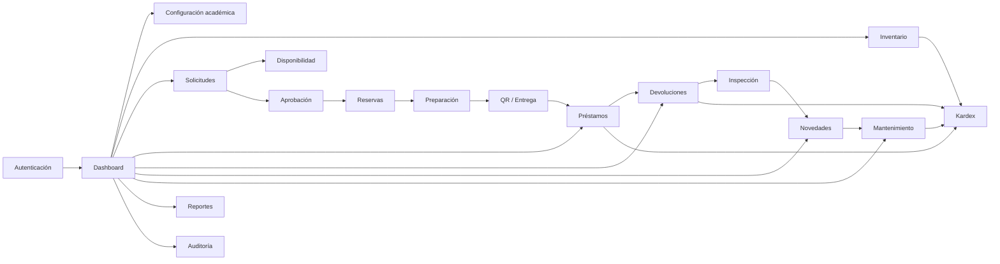
```mermaid
flowchart LR
    A[Autenticación] --> B[Dashboard]

    B --> C[Configuración académica]
    B --> D[Inventario]
    B --> E[Solicitudes]
    B --> F[Préstamos]
    B --> G[Devoluciones]
    B --> H[Novedades]
    B --> I[Mantenimiento]
    B --> J[Reportes]
    B --> K[Auditoría]

    E --> L[Disponibilidad]
    E --> M[Aprobación]
    M --> N[Reservas]
    N --> O[Preparación]
    O --> P[QR / Entrega]
    P --> F

    F --> G
    G --> Q[Inspección]
    Q --> H
    H --> I

    D --> R[Kardex]
    F --> R
    G --> R
    I --> R
```

---

# 3. Arquitectura propuesta

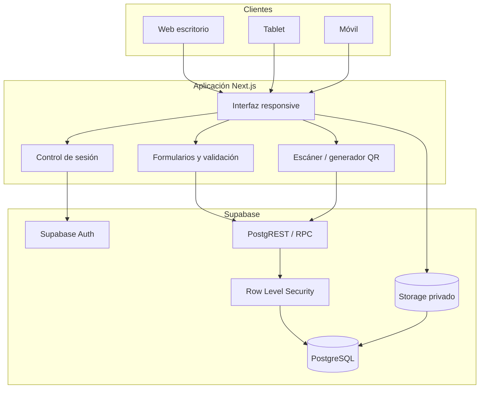
```mermaid
flowchart TB

    subgraph Client["Clientes"]
        WEB[Web escritorio]
        TABLET[Tablet]
        MOBILE[Móvil]
    end

    subgraph Frontend["Aplicación Next.js"]
        UI[Interfaz responsive]
        AUTH_UI[Control de sesión]
        FORMS[Formularios y validación]
        QR[Escáner / generador QR]
    end

    subgraph Supabase["Supabase"]
        AUTH[Supabase Auth]
        API[PostgREST / RPC]
        DB[(PostgreSQL)]
        STORAGE[(Storage privado)]
        RLS[Row Level Security]
    end

    WEB --> UI
    TABLET --> UI
    MOBILE --> UI

    UI --> AUTH_UI
    UI --> FORMS
    UI --> QR

    AUTH_UI --> AUTH
    FORMS --> API
    QR --> API

    API --> RLS
    RLS --> DB

    UI --> STORAGE
    STORAGE --> DB
```

---

# 4. Actores y casos de uso

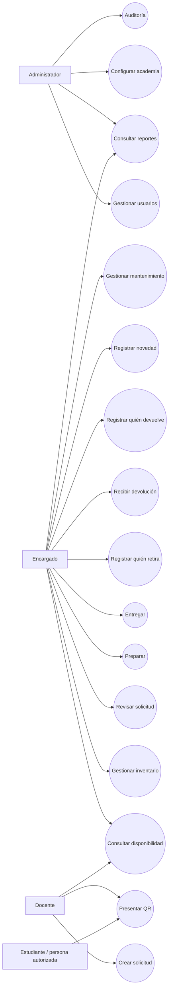
```mermaid
flowchart LR

    ADMIN[Administrador]
    MANAGER[Encargado]
    TEACHER[Docente]
    PICKUP[Estudiante / persona autorizada]

    UC1((Gestionar usuarios))
    UC2((Configurar academia))
    UC3((Gestionar inventario))
    UC4((Crear solicitud))
    UC5((Consultar disponibilidad))
    UC6((Revisar solicitud))
    UC7((Preparar))
    UC8((Entregar))
    UC9((Registrar quién retira))
    UC10((Recibir devolución))
    UC11((Registrar quién devuelve))
    UC12((Registrar novedad))
    UC13((Gestionar mantenimiento))
    UC14((Consultar reportes))
    UC15((Auditoría))
    UC16((Presentar QR))

    ADMIN --> UC1
    ADMIN --> UC2
    ADMIN --> UC14
    ADMIN --> UC15

    MANAGER --> UC3
    MANAGER --> UC5
    MANAGER --> UC6
    MANAGER --> UC7
    MANAGER --> UC8
    MANAGER --> UC9
    MANAGER --> UC10
    MANAGER --> UC11
    MANAGER --> UC12
    MANAGER --> UC13
    MANAGER --> UC14

    TEACHER --> UC4
    TEACHER --> UC5
    TEACHER --> UC16

    PICKUP --> UC16
```

> El estudiante/persona autorizada no es un usuario del sistema en el MVP. Su participación es física y queda registrada por el encargado.

---

# 5. Diagrama de clases del dominio

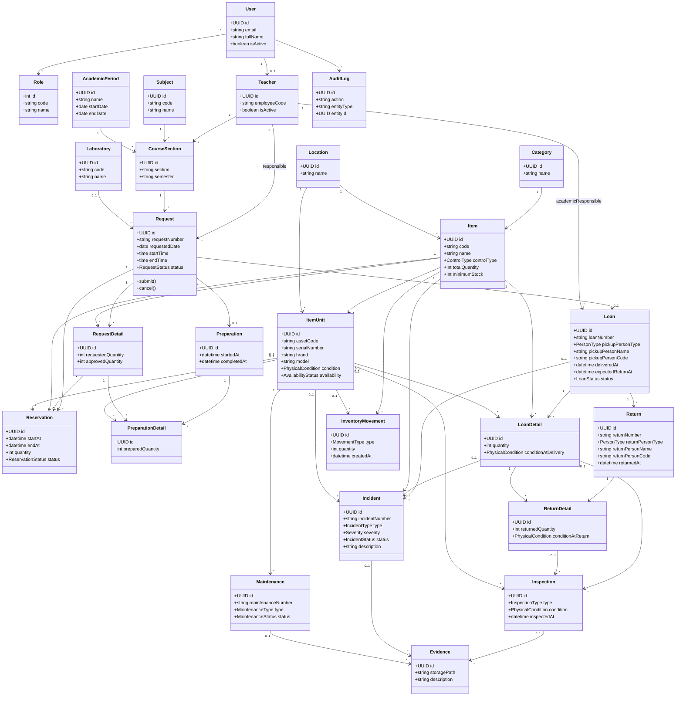
```mermaid
classDiagram

    class User {
      +UUID id
      +string email
      +string fullName
      +boolean isActive
    }

    class Role {
      +int id
      +string code
      +string name
    }

    class Teacher {
      +UUID id
      +string employeeCode
      +boolean isActive
    }

    class AcademicPeriod {
      +UUID id
      +string name
      +date startDate
      +date endDate
    }

    class Subject {
      +UUID id
      +string code
      +string name
    }

    class CourseSection {
      +UUID id
      +string section
      +string semester
    }

    class Laboratory {
      +UUID id
      +string code
      +string name
    }

    class Category {
      +UUID id
      +string name
    }

    class Location {
      +UUID id
      +string name
    }

    class Item {
      +UUID id
      +string code
      +string name
      +ControlType controlType
      +int totalQuantity
      +int minimumStock
    }

    class ItemUnit {
      +UUID id
      +string assetCode
      +string serialNumber
      +string brand
      +string model
      +PhysicalCondition condition
      +AvailabilityStatus availability
    }

    class Request {
      +UUID id
      +string requestNumber
      +date requestedDate
      +time startTime
      +time endTime
      +RequestStatus status
      +submit()
      +cancel()
    }

    class RequestDetail {
      +UUID id
      +int requestedQuantity
      +int approvedQuantity
    }

    class Reservation {
      +UUID id
      +datetime startAt
      +datetime endAt
      +int quantity
      +ReservationStatus status
    }

    class Preparation {
      +UUID id
      +datetime startedAt
      +datetime completedAt
    }

    class PreparationDetail {
      +UUID id
      +int preparedQuantity
    }

    class Loan {
      +UUID id
      +string loanNumber
      +PersonType pickupPersonType
      +string pickupPersonName
      +string pickupPersonCode
      +datetime deliveredAt
      +datetime expectedReturnAt
      +LoanStatus status
    }

    class LoanDetail {
      +UUID id
      +int quantity
      +PhysicalCondition conditionAtDelivery
    }

    class Return {
      +UUID id
      +string returnNumber
      +PersonType returnPersonType
      +string returnPersonName
      +string returnPersonCode
      +datetime returnedAt
    }

    class ReturnDetail {
      +UUID id
      +int returnedQuantity
      +PhysicalCondition conditionAtReturn
    }

    class Inspection {
      +UUID id
      +InspectionType type
      +PhysicalCondition condition
      +datetime inspectedAt
    }

    class Evidence {
      +UUID id
      +string storagePath
      +string description
    }

    class Incident {
      +UUID id
      +string incidentNumber
      +IncidentType type
      +Severity severity
      +IncidentStatus status
      +string description
    }

    class Maintenance {
      +UUID id
      +string maintenanceNumber
      +MaintenanceType type
      +MaintenanceStatus status
    }

    class InventoryMovement {
      +UUID id
      +MovementType type
      +int quantity
      +datetime createdAt
    }

    class AuditLog {
      +UUID id
      +string action
      +string entityType
      +UUID entityId
    }

    User "*" --> "*" Role
    User "1" --> "0..1" Teacher

    Teacher "1" --> "*" CourseSection
    Subject "1" --> "*" CourseSection
    AcademicPeriod "1" --> "*" CourseSection

    Category "1" --> "*" Item
    Location "1" --> "*" Item
    Item "1" --> "*" ItemUnit
    Location "1" --> "*" ItemUnit

    Teacher "1" --> "*" Request : responsible
    CourseSection "1" --> "*" Request
    Laboratory "0..1" --> "*" Request

    Request "1" --> "*" RequestDetail
    Item "1" --> "*" RequestDetail

    Request "1" --> "*" Reservation
    RequestDetail "1" --> "*" Reservation
    Item "1" --> "*" Reservation
    ItemUnit "0..1" --> "*" Reservation

    Request "1" --> "0..1" Preparation
    Preparation "1" --> "*" PreparationDetail
    RequestDetail "1" --> "*" PreparationDetail
    ItemUnit "0..1" --> "*" PreparationDetail

    Request "1" --> "0..1" Loan
    Teacher "1" --> "*" Loan : academicResponsible
    Loan "1" --> "*" LoanDetail
    Item "1" --> "*" LoanDetail
    ItemUnit "0..1" --> "*" LoanDetail

    Loan "1" --> "*" Return
    Return "1" --> "*" ReturnDetail
    LoanDetail "1" --> "*" ReturnDetail

    LoanDetail "0..1" --> "*" Inspection
    ReturnDetail "0..1" --> "*" Inspection
    ItemUnit "0..1" --> "*" Inspection

    Inspection "0..1" --> "*" Evidence
    Incident "0..1" --> "*" Evidence
    Maintenance "0..1" --> "*" Evidence

    Loan "0..1" --> "*" Incident
    LoanDetail "0..1" --> "*" Incident
    Item "1" --> "*" Incident
    ItemUnit "0..1" --> "*" Incident

    ItemUnit "1" --> "*" Maintenance
    Item "1" --> "*" InventoryMovement
    ItemUnit "0..1" --> "*" InventoryMovement

    User "1" --> "*" AuditLog
```

---

# 6. Secuencia: creación de solicitud

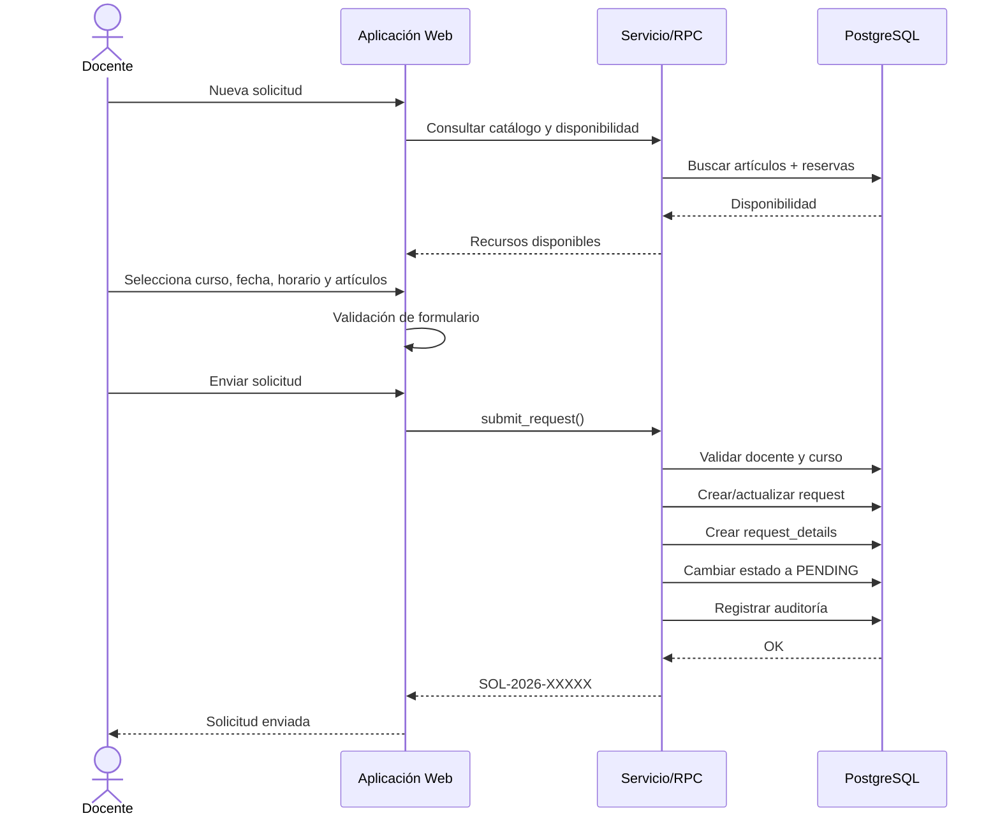
```mermaid
sequenceDiagram
    actor D as Docente
    participant UI as Aplicación Web
    participant API as Servicio/RPC
    participant DB as PostgreSQL

    D->>UI: Nueva solicitud
    UI->>API: Consultar catálogo y disponibilidad
    API->>DB: Buscar artículos + reservas
    DB-->>API: Disponibilidad
    API-->>UI: Recursos disponibles

    D->>UI: Selecciona curso, fecha, horario y artículos
    UI->>UI: Validación de formulario
    D->>UI: Enviar solicitud

    UI->>API: submit_request()
    API->>DB: Validar docente y curso
    API->>DB: Crear/actualizar request
    API->>DB: Crear request_details
    API->>DB: Cambiar estado a PENDING
    API->>DB: Registrar auditoría

    DB-->>API: OK
    API-->>UI: SOL-2026-XXXXX
    UI-->>D: Solicitud enviada
```

---

# 7. Secuencia: aprobación y reserva

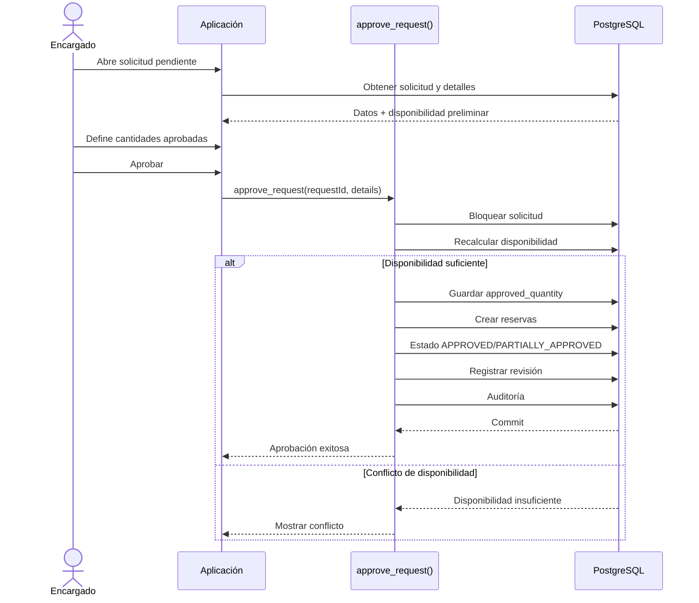
```mermaid
sequenceDiagram
    actor E as Encargado
    participant UI as Aplicación
    participant RPC as approve_request()
    participant DB as PostgreSQL

    E->>UI: Abre solicitud pendiente
    UI->>DB: Obtener solicitud y detalles
    DB-->>UI: Datos + disponibilidad preliminar

    E->>UI: Define cantidades aprobadas
    E->>UI: Aprobar

    UI->>RPC: approve_request(requestId, details)

    RPC->>DB: Bloquear solicitud
    RPC->>DB: Recalcular disponibilidad

    alt Disponibilidad suficiente
        RPC->>DB: Guardar approved_quantity
        RPC->>DB: Crear reservas
        RPC->>DB: Estado APPROVED/PARTIALLY_APPROVED
        RPC->>DB: Registrar revisión
        RPC->>DB: Auditoría
        DB-->>RPC: Commit
        RPC-->>UI: Aprobación exitosa
    else Conflicto de disponibilidad
        DB-->>RPC: Disponibilidad insuficiente
        RPC-->>UI: Mostrar conflicto
    end
```

---

# 8. Secuencia: preparación

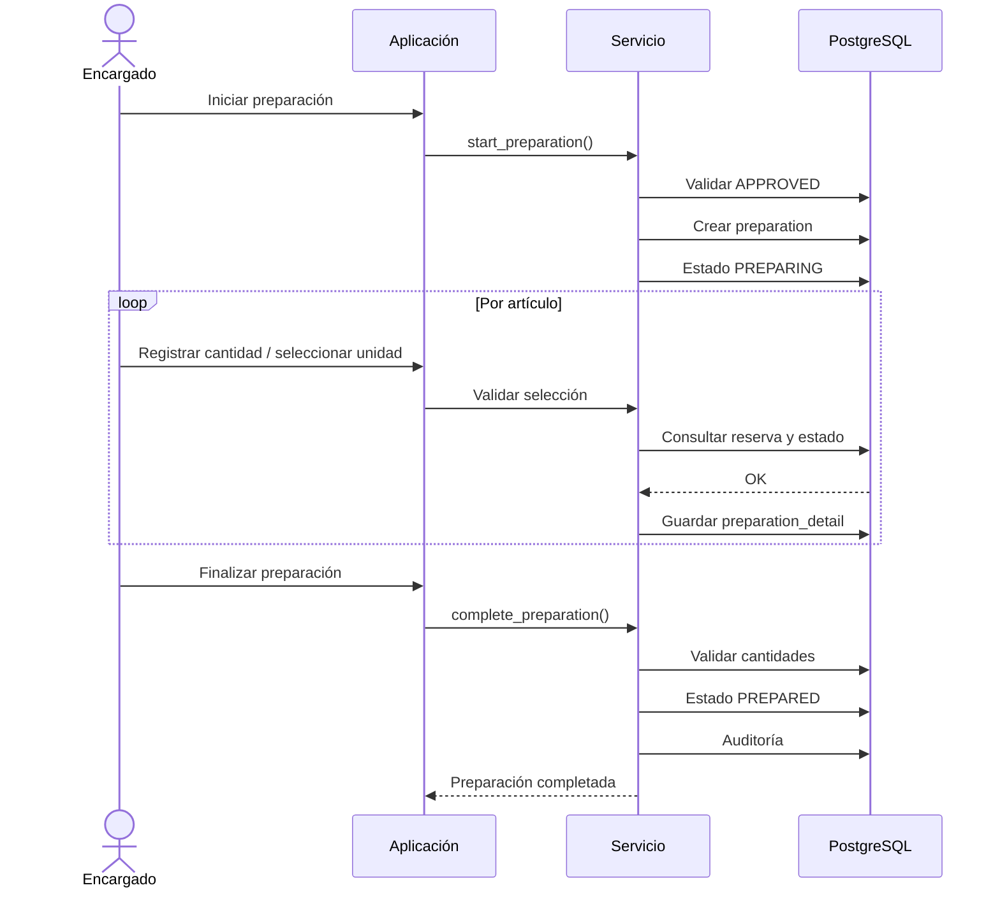
```mermaid
sequenceDiagram
    actor E as Encargado
    participant UI as Aplicación
    participant API as Servicio
    participant DB as PostgreSQL

    E->>UI: Iniciar preparación
    UI->>API: start_preparation()
    API->>DB: Validar APPROVED
    API->>DB: Crear preparation
    API->>DB: Estado PREPARING

    loop Por artículo
        E->>UI: Registrar cantidad / seleccionar unidad
        UI->>API: Validar selección
        API->>DB: Consultar reserva y estado
        DB-->>API: OK
        API->>DB: Guardar preparation_detail
    end

    E->>UI: Finalizar preparación
    UI->>API: complete_preparation()
    API->>DB: Validar cantidades
    API->>DB: Estado PREPARED
    API->>DB: Auditoría
    API-->>UI: Preparación completada
```

---

# 9. Secuencia: entrega con estudiante autorizado

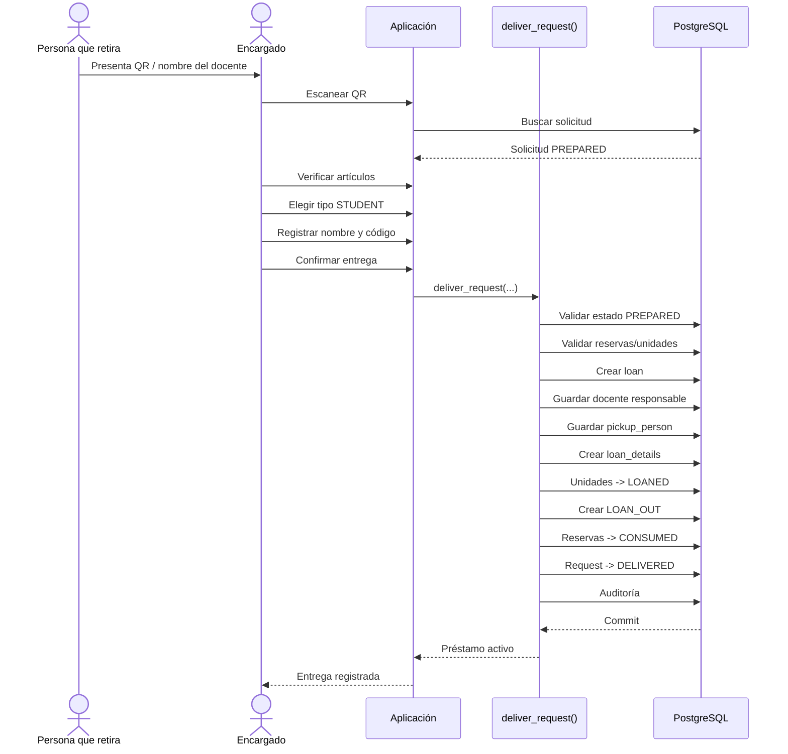
```mermaid
sequenceDiagram
    actor P as Persona que retira
    actor E as Encargado
    participant UI as Aplicación
    participant RPC as deliver_request()
    participant DB as PostgreSQL

    P->>E: Presenta QR / nombre del docente
    E->>UI: Escanear QR
    UI->>DB: Buscar solicitud
    DB-->>UI: Solicitud PREPARED

    E->>UI: Verificar artículos
    E->>UI: Elegir tipo STUDENT
    E->>UI: Registrar nombre y código
    E->>UI: Confirmar entrega

    UI->>RPC: deliver_request(...)

    RPC->>DB: Validar estado PREPARED
    RPC->>DB: Validar reservas/unidades
    RPC->>DB: Crear loan
    RPC->>DB: Guardar docente responsable
    RPC->>DB: Guardar pickup_person
    RPC->>DB: Crear loan_details
    RPC->>DB: Unidades -> LOANED
    RPC->>DB: Crear LOAN_OUT
    RPC->>DB: Reservas -> CONSUMED
    RPC->>DB: Request -> DELIVERED
    RPC->>DB: Auditoría

    DB-->>RPC: Commit
    RPC-->>UI: Préstamo activo
    UI-->>E: Entrega registrada
```

---

# 10. Secuencia: entrega retirada por el docente

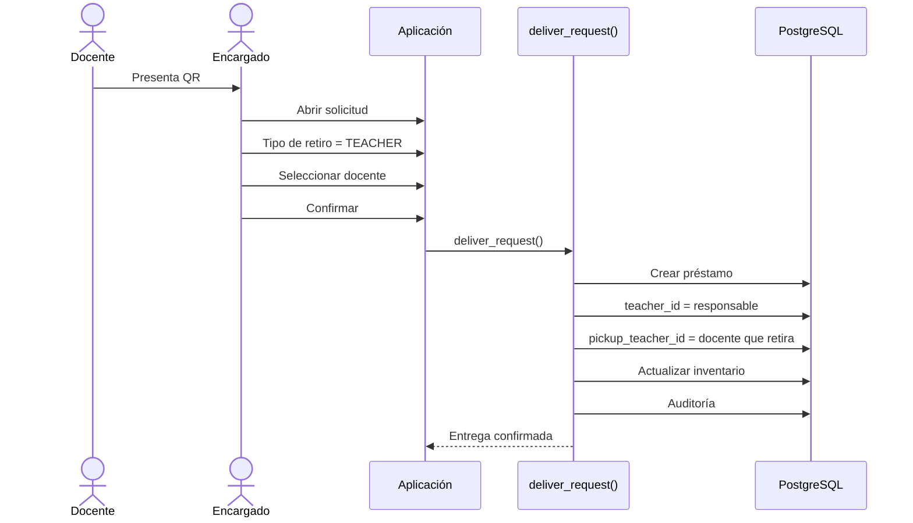
```mermaid
sequenceDiagram
    actor D as Docente
    actor E as Encargado
    participant UI as Aplicación
    participant RPC as deliver_request()
    participant DB as PostgreSQL

    D->>E: Presenta QR
    E->>UI: Abrir solicitud
    E->>UI: Tipo de retiro = TEACHER
    E->>UI: Seleccionar docente
    E->>UI: Confirmar

    UI->>RPC: deliver_request()
    RPC->>DB: Crear préstamo
    RPC->>DB: teacher_id = responsable
    RPC->>DB: pickup_teacher_id = docente que retira
    RPC->>DB: Actualizar inventario
    RPC->>DB: Auditoría
    RPC-->>UI: Entrega confirmada
```

---

# 11. Secuencia: devolución parcial

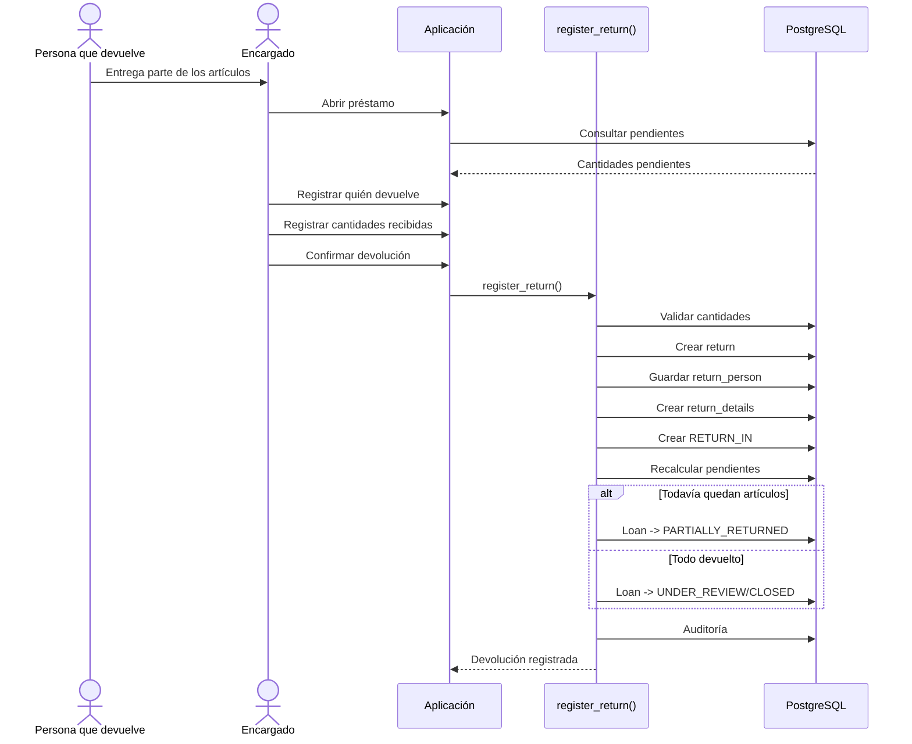
```mermaid
sequenceDiagram
    actor P as Persona que devuelve
    actor E as Encargado
    participant UI as Aplicación
    participant RPC as register_return()
    participant DB as PostgreSQL

    P->>E: Entrega parte de los artículos
    E->>UI: Abrir préstamo
    UI->>DB: Consultar pendientes
    DB-->>UI: Cantidades pendientes

    E->>UI: Registrar quién devuelve
    E->>UI: Registrar cantidades recibidas
    E->>UI: Confirmar devolución

    UI->>RPC: register_return()

    RPC->>DB: Validar cantidades
    RPC->>DB: Crear return
    RPC->>DB: Guardar return_person
    RPC->>DB: Crear return_details
    RPC->>DB: Crear RETURN_IN
    RPC->>DB: Recalcular pendientes

    alt Todavía quedan artículos
        RPC->>DB: Loan -> PARTIALLY_RETURNED
    else Todo devuelto
        RPC->>DB: Loan -> UNDER_REVIEW/CLOSED
    end

    RPC->>DB: Auditoría
    RPC-->>UI: Devolución registrada
```

---

# 12. Secuencia: devolución con daño

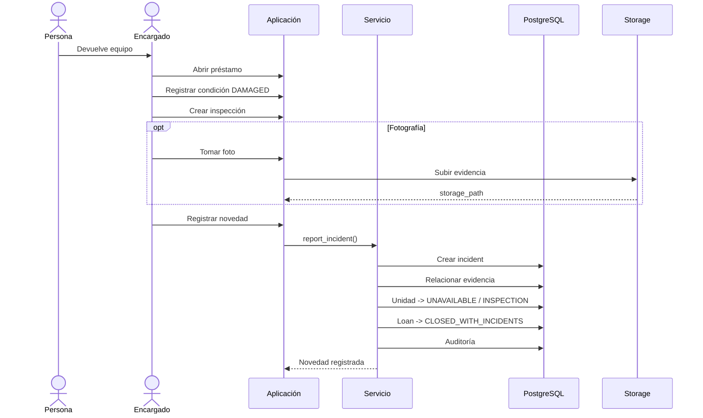
```mermaid
sequenceDiagram
    actor P as Persona
    actor E as Encargado
    participant UI as Aplicación
    participant API as Servicio
    participant DB as PostgreSQL
    participant ST as Storage

    P->>E: Devuelve equipo
    E->>UI: Abrir préstamo
    E->>UI: Registrar condición DAMAGED
    E->>UI: Crear inspección
    opt Fotografía
        E->>UI: Tomar foto
        UI->>ST: Subir evidencia
        ST-->>UI: storage_path
    end

    E->>UI: Registrar novedad
    UI->>API: report_incident()

    API->>DB: Crear incident
    API->>DB: Relacionar evidencia
    API->>DB: Unidad -> UNAVAILABLE / INSPECTION
    API->>DB: Loan -> CLOSED_WITH_INCIDENTS
    API->>DB: Auditoría

    API-->>UI: Novedad registrada
```

---

# 13. Secuencia: mantenimiento

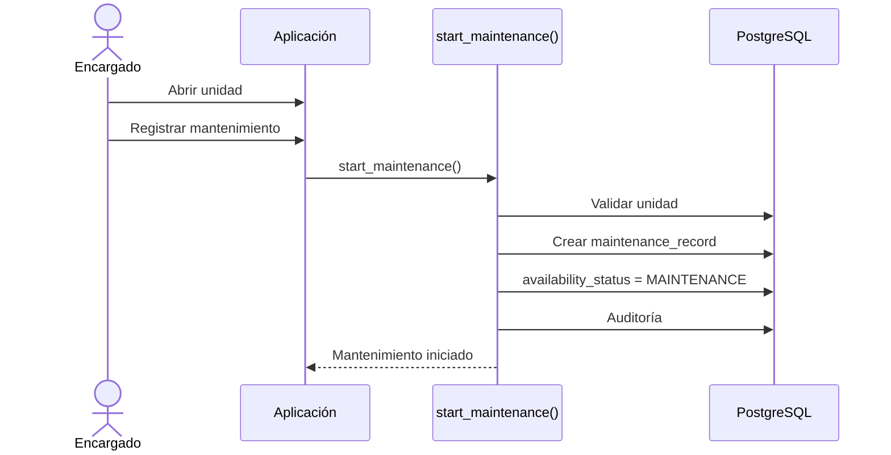
```mermaid
sequenceDiagram
    actor E as Encargado
    participant UI as Aplicación
    participant RPC as start_maintenance()
    participant DB as PostgreSQL

    E->>UI: Abrir unidad
    E->>UI: Registrar mantenimiento
    UI->>RPC: start_maintenance()

    RPC->>DB: Validar unidad
    RPC->>DB: Crear maintenance_record
    RPC->>DB: availability_status = MAINTENANCE
    RPC->>DB: Auditoría

    RPC-->>UI: Mantenimiento iniciado
```

---

# 14. Máquina de estados de solicitud

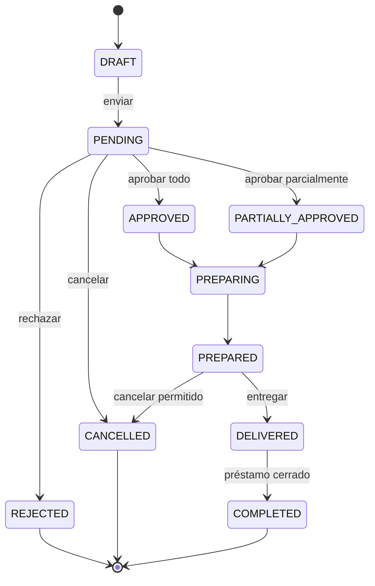
```mermaid
stateDiagram-v2
    [*] --> DRAFT

    DRAFT --> PENDING : enviar

    PENDING --> APPROVED : aprobar todo
    PENDING --> PARTIALLY_APPROVED : aprobar parcialmente
    PENDING --> REJECTED : rechazar
    PENDING --> CANCELLED : cancelar

    APPROVED --> PREPARING
    PARTIALLY_APPROVED --> PREPARING

    PREPARING --> PREPARED

    PREPARED --> DELIVERED : entregar
    PREPARED --> CANCELLED : cancelar permitido

    DELIVERED --> COMPLETED : préstamo cerrado

    REJECTED --> [*]
    CANCELLED --> [*]
    COMPLETED --> [*]
```

---

# 15. Máquina de estados del préstamo

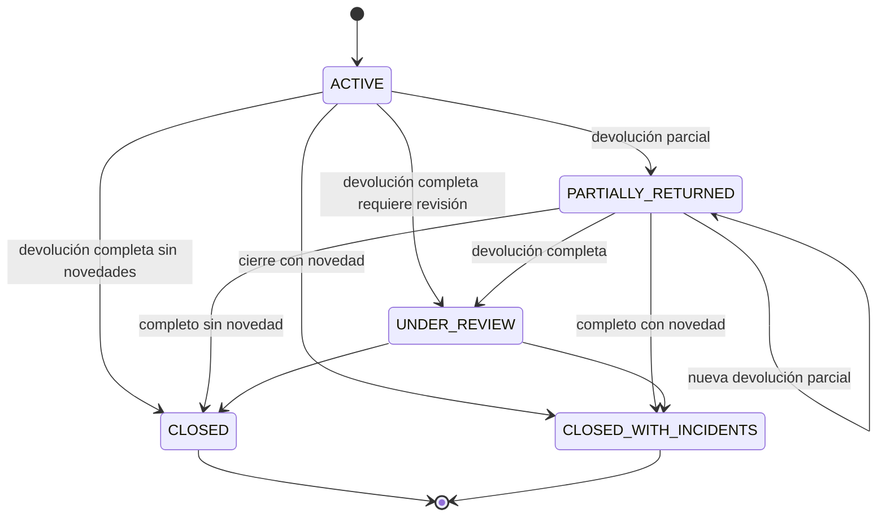
```mermaid
stateDiagram-v2
    [*] --> ACTIVE

    ACTIVE --> PARTIALLY_RETURNED : devolución parcial
    ACTIVE --> UNDER_REVIEW : devolución completa requiere revisión
    ACTIVE --> CLOSED : devolución completa sin novedades
    ACTIVE --> CLOSED_WITH_INCIDENTS : cierre con novedad

    PARTIALLY_RETURNED --> PARTIALLY_RETURNED : nueva devolución parcial
    PARTIALLY_RETURNED --> UNDER_REVIEW : devolución completa
    PARTIALLY_RETURNED --> CLOSED : completo sin novedad
    PARTIALLY_RETURNED --> CLOSED_WITH_INCIDENTS : completo con novedad

    UNDER_REVIEW --> CLOSED
    UNDER_REVIEW --> CLOSED_WITH_INCIDENTS

    CLOSED --> [*]
    CLOSED_WITH_INCIDENTS --> [*]
```

---

# 16. Máquina de estados de unidad individual

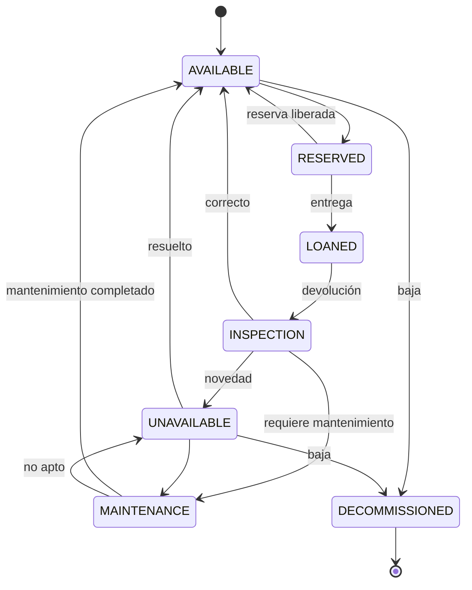
```mermaid
stateDiagram-v2

    [*] --> AVAILABLE

    AVAILABLE --> RESERVED
    RESERVED --> AVAILABLE : reserva liberada
    RESERVED --> LOANED : entrega

    LOANED --> INSPECTION : devolución
    INSPECTION --> AVAILABLE : correcto
    INSPECTION --> UNAVAILABLE : novedad
    INSPECTION --> MAINTENANCE : requiere mantenimiento

    UNAVAILABLE --> MAINTENANCE
    UNAVAILABLE --> AVAILABLE : resuelto

    MAINTENANCE --> AVAILABLE : mantenimiento completado
    MAINTENANCE --> UNAVAILABLE : no apto

    AVAILABLE --> DECOMMISSIONED : baja
    UNAVAILABLE --> DECOMMISSIONED : baja

    DECOMMISSIONED --> [*]
```

---

# 17. Máquina de estados de novedad

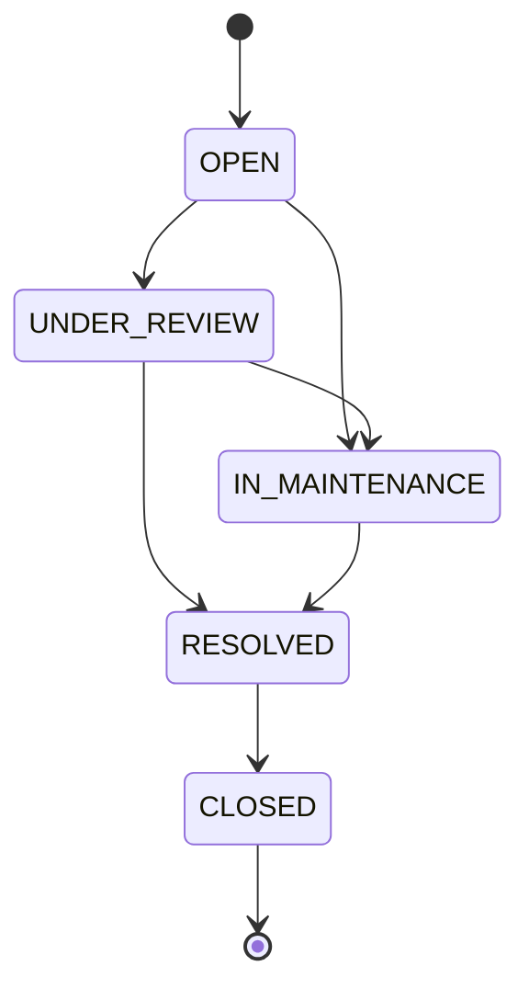
```mermaid
stateDiagram-v2
    [*] --> OPEN

    OPEN --> UNDER_REVIEW
    OPEN --> IN_MAINTENANCE
    UNDER_REVIEW --> IN_MAINTENANCE
    UNDER_REVIEW --> RESOLVED
    IN_MAINTENANCE --> RESOLVED
    RESOLVED --> CLOSED

    CLOSED --> [*]
```

---

# 18. Actividad: cálculo de disponibilidad

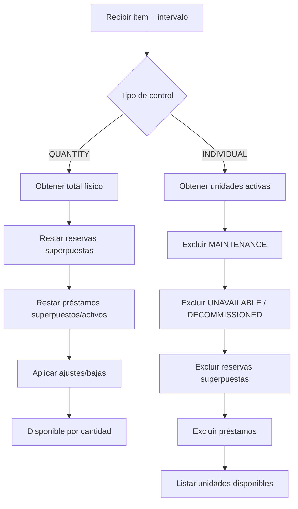
```mermaid
flowchart TD
    A[Recibir item + intervalo] --> B{Tipo de control}

    B -->|QUANTITY| C[Obtener total físico]
    C --> D[Restar reservas superpuestas]
    D --> E[Restar préstamos superpuestos/activos]
    E --> F[Aplicar ajustes/bajas]
    F --> G[Disponible por cantidad]

    B -->|INDIVIDUAL| H[Obtener unidades activas]
    H --> I[Excluir MAINTENANCE]
    I --> J[Excluir UNAVAILABLE / DECOMMISSIONED]
    J --> K[Excluir reservas superpuestas]
    K --> L[Excluir préstamos]
    L --> M[Listar unidades disponibles]
```

---

# 19. Actividad: aprobación

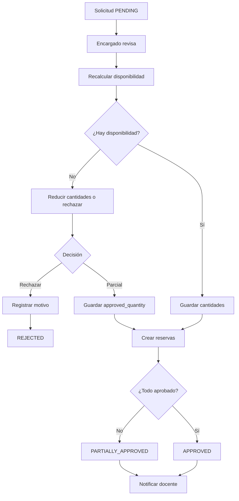
```mermaid
flowchart TD
    A[Solicitud PENDING] --> B[Encargado revisa]
    B --> C[Recalcular disponibilidad]
    C --> D{¿Hay disponibilidad?}

    D -->|No| E[Reducir cantidades o rechazar]
    E --> F{Decisión}
    F -->|Parcial| G[Guardar approved_quantity]
    F -->|Rechazar| H[Registrar motivo]
    H --> I[REJECTED]

    D -->|Sí| J[Guardar cantidades]
    J --> K[Crear reservas]
    G --> K

    K --> L{¿Todo aprobado?}
    L -->|Sí| M[APPROVED]
    L -->|No| N[PARTIALLY_APPROVED]

    M --> O[Notificar docente]
    N --> O
```

---

# 20. Actividad: entrega

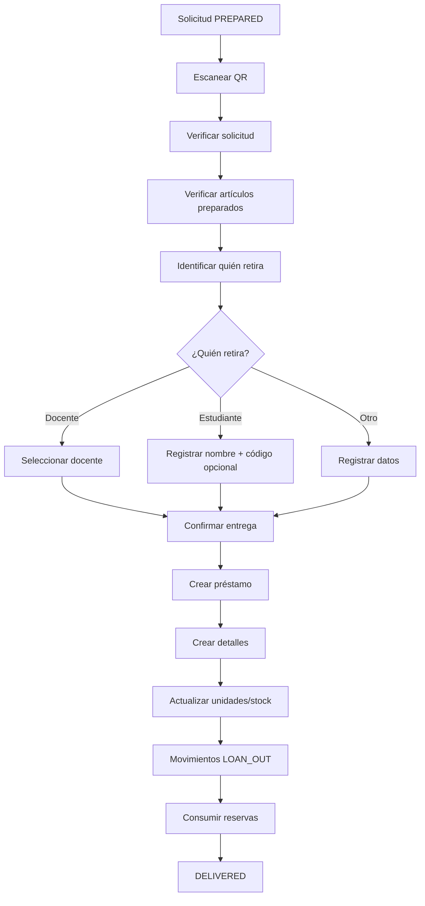
```mermaid
flowchart TD
    A[Solicitud PREPARED] --> B[Escanear QR]
    B --> C[Verificar solicitud]
    C --> D[Verificar artículos preparados]
    D --> E[Identificar quién retira]

    E --> F{¿Quién retira?}
    F -->|Docente| G[Seleccionar docente]
    F -->|Estudiante| H[Registrar nombre + código opcional]
    F -->|Otro| I[Registrar datos]

    G --> J[Confirmar entrega]
    H --> J
    I --> J

    J --> K[Crear préstamo]
    K --> L[Crear detalles]
    L --> M[Actualizar unidades/stock]
    M --> N[Movimientos LOAN_OUT]
    N --> O[Consumir reservas]
    O --> P[DELIVERED]
```

---

# 21. Actividad: devolución

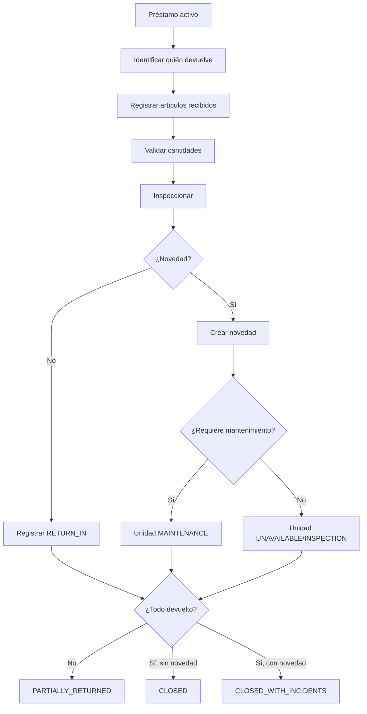
```mermaid
flowchart TD
    A[Préstamo activo] --> B[Identificar quién devuelve]
    B --> C[Registrar artículos recibidos]
    C --> D[Validar cantidades]
    D --> E[Inspeccionar]

    E --> F{¿Novedad?}
    F -->|No| G[Registrar RETURN_IN]
    F -->|Sí| H[Crear novedad]
    H --> I{¿Requiere mantenimiento?}
    I -->|Sí| J[Unidad MAINTENANCE]
    I -->|No| K[Unidad UNAVAILABLE/INSPECTION]

    G --> L{¿Todo devuelto?}
    J --> L
    K --> L

    L -->|No| M[PARTIALLY_RETURNED]
    L -->|Sí, sin novedad| N[CLOSED]
    L -->|Sí, con novedad| O[CLOSED_WITH_INCIDENTS]
```

---

# 22. Componentes de interfaz — Docente

```mermaid
flowchart TD
    A[Dashboard docente] --> B[Nueva solicitud]
    A --> C[Mis solicitudes]
    A --> D[Préstamos]
    A --> E[Notificaciones]

    B --> F[Seleccionar curso]
    F --> G[Fecha / horario]
    G --> H[Catálogo]
    H --> I[Disponibilidad]
    I --> J[Resumen]
    J --> K[Enviar]

    C --> L[Detalle solicitud]
    L --> M[QR si aprobada]
```

---

# 23. Componentes de interfaz — Encargado

```mermaid
flowchart TD
    A[Dashboard encargado] --> B[Solicitudes pendientes]
    A --> C[Preparadas hoy]
    A --> D[Préstamos activos]
    A --> E[Devoluciones pendientes]
    A --> F[Novedades]
    A --> G[Inventario]
    A --> H[Escanear QR]

    B --> I[Revisar]
    I --> J[Aprobar / parcial / rechazar]

    C --> K[Entrega]
    K --> L[Quién retira]

    D --> M[Detalle préstamo]
    M --> N[Registrar devolución]
    N --> O[Quién devuelve]
    O --> P[Inspección]
```

---

# 24. Componentes de interfaz — Administrador

```mermaid
flowchart TD
    A[Dashboard administrador] --> B[Usuarios]
    A --> C[Roles]
    A --> D[Periodos]
    A --> E[Asignaturas]
    A --> F[Cursos]
    A --> G[Laboratorios]
    A --> H[Categorías]
    A --> I[Ubicaciones]
    A --> J[Reportes]
    A --> K[Auditoría]
```

---

# 25. Diagrama de componentes lógico

```mermaid
flowchart TB
    UI[Presentation Layer<br/>Next.js + shadcn]
    APP[Application Services]
    AUTH[Authorization]
    INVENTORY[Inventory Service]
    REQUESTS[Request Service]
    LOANS[Loan Service]
    INCIDENTS[Incident Service]
    REPORTS[Reporting Service]
    STORAGE[Evidence Service]

    DB[(PostgreSQL)]
    SB_AUTH[Supabase Auth]
    SB_STORAGE[(Supabase Storage)]

    UI --> APP

    APP --> AUTH
    APP --> INVENTORY
    APP --> REQUESTS
    APP --> LOANS
    APP --> INCIDENTS
    APP --> REPORTS
    APP --> STORAGE

    AUTH --> SB_AUTH
    AUTH --> DB

    INVENTORY --> DB
    REQUESTS --> DB
    LOANS --> DB
    INCIDENTS --> DB
    REPORTS --> DB

    STORAGE --> SB_STORAGE
    STORAGE --> DB
```

---

# 26. Diagrama de despliegue

```mermaid
flowchart LR

    USER1[PC Encargado]
    USER2[Teléfono Encargado]
    USER3[PC/Móvil Docente]
    USER4[PC Administrador]

    VERCEL[Frontend Next.js<br/>Vercel]
    SUPABASE[Supabase Project]
    DB[(PostgreSQL)]
    AUTH[Auth]
    STORAGE[(Storage)]

    USER1 -->|HTTPS| VERCEL
    USER2 -->|HTTPS| VERCEL
    USER3 -->|HTTPS| VERCEL
    USER4 -->|HTTPS| VERCEL

    VERCEL -->|HTTPS| SUPABASE

    SUPABASE --> DB
    SUPABASE --> AUTH
    SUPABASE --> STORAGE
```

> Vercel es una propuesta, no una obligación institucional.

---

# 27. Matriz de permisos

| Función | Administrador | Encargado | Docente |
|---|---:|---:|---:|
| Gestionar usuarios | Sí | No | No |
| Configuración académica | Sí | Consulta | Consulta propia |
| Gestionar inventario | Sí/consulta | Sí | No |
| Consultar catálogo | Sí | Sí | Sí |
| Consultar disponibilidad | Sí | Sí | Sí |
| Crear solicitud | Opcional | No | Sí |
| Aprobar solicitud | No/según política | Sí | No |
| Preparar | No | Sí | No |
| Entregar | No | Sí | No |
| Registrar quién retira | No | Sí | No |
| Recibir devolución | No | Sí | No |
| Registrar quién devuelve | No | Sí | No |
| Registrar novedad | Consulta | Sí | No |
| Mantenimiento | Consulta | Sí | No |
| Reportes | Sí | Sí | Limitado |
| Auditoría | Sí | No | No |

---

# 28. Flujo de fotografías

```mermaid
sequenceDiagram
    actor E as Encargado
    participant UI as Aplicación
    participant ST as Storage
    participant DB as PostgreSQL

    E->>UI: Añadir fotografía
    UI->>UI: Validar tipo/tamaño
    UI->>ST: Upload a bucket privado
    ST-->>UI: storage_path
    UI->>DB: Crear evidence
    DB-->>UI: Evidencia registrada
```

---

# 29. Flujo del Kardex

```mermaid
flowchart LR
    A[Alta/entrada] --> K[Kardex]
    B[Entrega] --> K
    C[Devolución] --> K
    D[Ajuste] --> K
    E[Pérdida] --> K
    F[Baja] --> K
    G[Reactivación] --> K

    K --> H[Historial por artículo]
    K --> I[Historial por unidad]
    K --> J[Reportes]
```

---

# 30. Hoja de vida de equipo individual

```mermaid
flowchart TD
    UNIT[Unidad BAT-003] --> A[Datos generales]
    UNIT --> B[Estado actual]
    UNIT --> C[Préstamos]
    UNIT --> D[Inspecciones]
    UNIT --> E[Novedades]
    UNIT --> F[Mantenimientos]
    UNIT --> G[Fotografías]
    UNIT --> H[Movimientos]
```

---

# 31. Flujo de error por concurrencia

Caso: dos encargados intentan aprobar las últimas unidades.

```mermaid
sequenceDiagram
    participant A as Encargado A
    participant B as Encargado B
    participant RPC as RPC
    participant DB as PostgreSQL

    A->>RPC: Aprobar solicitud A
    B->>RPC: Aprobar solicitud B

    RPC->>DB: Tx A bloquea/revalida
    DB-->>RPC: Stock suficiente
    RPC->>DB: Crear reservas A
    RPC->>DB: COMMIT A

    RPC->>DB: Tx B revalida
    DB-->>RPC: Stock insuficiente
    RPC-->>B: Conflicto de disponibilidad
    RPC-->>A: Aprobación exitosa
```

La interfaz nunca será la fuente final de verdad.

---

# 32. Flujo de cancelación

```mermaid
flowchart TD
    A[Solicitud] --> B{Estado actual}

    B -->|DRAFT| C[Cancelar]
    B -->|PENDING| C
    B -->|APPROVED| D[Validar política]
    B -->|PARTIALLY_APPROVED| D
    B -->|PREPARED| D
    B -->|DELIVERED| E[No cancelar: gestionar préstamo]

    C --> F[CANCELLED]
    D --> G{Permitido}
    G -->|Sí| H[Liberar reservas]
    H --> F
    G -->|No| I[Rechazar acción]
```

---

# 33. Reportes mínimos

## Operativos

- solicitudes pendientes;
- solicitudes para hoy;
- préstamos activos;
- devoluciones vencidas;
- novedades abiertas;
- unidades en mantenimiento;
- stock bajo.

## Históricos

- préstamos por periodo;
- préstamos por docente;
- préstamos por asignatura;
- artículos más utilizados;
- novedades por tipo;
- unidades con más novedades;
- mantenimientos;
- Kardex.

---

# 34. Criterios de aceptación por módulo

## Inventario

- Crear artículo QUANTITY.
- Crear artículo INDIVIDUAL.
- Crear unidad individual.
- No permitir cantidad negativa.
- No prestar unidad no disponible.

## Solicitudes

- Docente puede crear.
- No puede solicitar intervalo inválido.
- Se calcula disponibilidad.
- Encargado puede aprobar parcialmente.
- No se sobre-reserva.

## Preparación

- Solo solicitudes aprobadas.
- Unidades seleccionadas deben estar válidas.
- Cantidad preparada no supera aprobada.

## Entrega

- Solo PREPARED.
- Registra docente responsable.
- Registra quién retira.
- Registra encargado que entrega.
- Cambia disponibilidad.
- Genera préstamo y Kardex.

## Devolución

- Registra quién devuelve.
- Registra encargado que recibe.
- Permite devolución parcial.
- Nunca permite devolver más de lo prestado.
- Actualiza inventario.

## Novedades

- Permite tipo y severidad.
- Puede adjuntar foto.
- Mantiene seguimiento.
- Puede disparar mantenimiento.

## Auditoría

- No se puede omitir en operaciones críticas.

---

# 35. Orden recomendado de implementación

```mermaid
flowchart TD
    A[1. Auth + usuarios + roles] --> B[2. Academia]
    B --> C[3. Inventario]
    C --> D[4. Disponibilidad]
    D --> E[5. Solicitudes]
    E --> F[6. Aprobación + reservas]
    F --> G[7. Preparación]
    G --> H[8. QR + entrega]
    H --> I[9. Préstamos]
    I --> J[10. Devoluciones]
    J --> K[11. Inspecciones]
    K --> L[12. Novedades]
    L --> M[13. Mantenimiento]
    M --> N[14. Kardex]
    N --> O[15. Dashboard/reportes]
    O --> P[16. Auditoría/RLS endurecida]
```

---

# 36. Frontera arquitectónica del proyecto

El sistema termina funcionalmente en:

```text
inventario
→ solicitud
→ reserva
→ preparación
→ entrega
→ préstamo
→ devolución
→ inspección
→ novedad/mantenimiento
→ historial/auditoría
```

No deben añadirse módulos laterales que no sean necesarios para este ciclo durante el MVP.

---

# 37. Decisiones congeladas

Estas decisiones se consideran base del proyecto:

1. Tres roles: administrador, encargado, docente.
2. Estudiantes sin cuenta propia en el MVP.
3. Docente como responsable académico.
4. Persona que retira registrada independientemente.
5. Persona que devuelve registrada independientemente.
6. Dos tipos de inventario: QUANTITY e INDIVIDUAL.
7. Fotografías opcionales.
8. QR asociado a solicitud.
9. Devoluciones parciales.
10. Novedades como entidad formal.
11. Mantenimiento solo para unidades individualizadas.
12. Disponibilidad calculada, no almacenada como número fijo.
13. Operaciones críticas transaccionales.
14. Historial no se borra.
15. Aplicación web responsive como plataforma principal.

Estas decisiones deben modificarse únicamente si aparece un requisito institucional explícito que lo justifique.
